<table border="0" cellpadding="0" cellspacing="0" width="100%">
  <tr>
    <td width="65%" valign="top">
      <h1> Salut, moi c'est Rafael</h1>
      

        Actuellement en <b>2ème année de classe préparatoire à l'ESIEE Paris</b>, je suis un développeur passionné par l'intersection entre le <b>design élégant</b> et l'<b>ingénierie robuste</b>. Mon parcours est guidé par la conviction que le code ne doit pas seulement fonctionner, il doit aussi raconter une histoire.
      

      

        Mon approche est celle d'un <b>"Builder"</b> : si un outil me limite ou me frustre, ma réaction naturelle est de <b>recoder ma propre version</b> pour ne plus avoir de limites. C'est ce besoin de maîtrise totale qui m'a poussé à concevoir <b>RVPKG</b>, mon propre langage de programmation.
      

      

        J'aime transformer des idées abstraites en produits numériques performants. Ma curiosité me pousse constamment à explorer de nouveaux horizons technologiques, de l'optimisation de systèmes à l'intégration de solutions innovantes. Au-delà de la technique, je suis un fervent défenseur de la collaboration en open-source et du partage de connaissances, convaincu que les meilleures solutions émergent de la diversité des perspectives.
      

    </td>
    <td width="35%" align="center" valign="middle">
      
      
    </td>
  </tr>
</table>

 

  <b>Hors du terminal...</b> Quand je ne suis pas en train de compiler un nouveau projet, je passe mon temps à jouer du <b>piano</b> ou de la <b>guitare</b>, ou à perfectionner mon aim sur <b>osu!</b> et mes builds sur <b>Genshin Impact</b>. Ces passions nourrissent ma créativité et ma persévérance, des qualités que je réinjecte chaque jour dans mon code.

 

<h2>Mon Arsenal Technologique</h2>

  En tant qu'étudiant à l'<b>ESIEE Paris</b> et créateur de langage, je privilégie la compréhension profonde des systèmes. Voici les outils que je maîtrise, ceux que je déploie à la demande, et ceux que je dompte actuellement.

  <h3>• Langages de Prédilection •</h3>
  
  
  
  
  
  
   

  <h3>• Backend & Infrastructure •</h3>
  
  
  
  
  

   

  <h3>• Environnement & Tools •</h3>
  
  
  
  
  

  <h3>• My Own Creation •</h3>
  

 

<table border="0" cellpadding="0" cellspacing="0" width="100%">
  <tr>
    <td width="50%" valign="top">
      <h3>🚀 À la demande (Bases solides)</h3>
      <ul>
        <li><b>Frontend :</b> Tailwind CSS, Bootstrap, Electron.</li>
        <li><b>Web :</b> PHP, Vercel, GitHub Actions.</li>
        <li><b>Scientifique :</b> MATLAB.</li>
      </ul>
    </td>
    <td width="50%" valign="top">
      <h3>🔍 En cours d'exploration</h3>
      <ul>
        <li><b>DevOps :</b> Docker (Conteneurisation).</li>
        <li><b>Système :</b> Approfondissement du C & Architecture.</li>
        <li><b>Cloud :</b> Firebase & déploiement scalable.</li>
      </ul>
    </td>
  </tr>
</table>

 

<h2>Mes plus gros projets</h2>

  Voici un aperçu de l’un de mes projets phares, qui illustre ma capacité à mener des développements de bout en bout, de la conception à la mise en production. N’hésitez pas à consulter le dépôt pour plus de détails !

  

 

<h2>Commits</h2>

  L’animation ci-dessous représente l’évolution de mes contributions sur GitHub. Elle met en avant la régularité et la passion que j’investis dans mes projets open-source.

 

<h2>Mes langages de programmation</h2>

  Voici un aperçu des langages que j’utilise le plus, ainsi que de mon activité sur GitHub. Cela reflète la diversité de mes compétences et mon engagement à explorer différents écosystèmes.

  

 

<h2>Activité GitHub</h2>

  Ce graphique met en lumière mon activité sur GitHub au fil du temps. Il illustre les périodes d’intense développement, les contributions régulières et l’évolution de mes projets.

  

 

<h2>Rejoins-moi sur Discord</h2>

  Envie d’échanger en direct, de poser une question ou de rejoindre une communauté tech ? Mon Discord est ouvert à tous les passionnés !

  

 

<h2>Mes stats GitHub</h2>

  Voici un aperçu de mes statistiques GitHub, qui mettent en avant mon engagement, la diversité de mes contributions et ma passion pour le développement.

  

 

<h2>Parlons de ton Projet</h2>

  Tu as une idée, un projet ou simplement envie de discuter tech ? Je suis toujours partant pour de nouveaux défis et collaborations. N’hésite pas à me contacter via les liens ci-dessous !

<table border="0" cellpadding="0" cellspacing="0" width="100%">
  <tr>
    <td width="40%" align="center" valign="middle">
      
    </td>
    <td width="60%" valign="top">
      

        
        
        
      

      

        À très vite pour coder l’avenir ensemble !
      

    </td>
  </tr>
</table>

  

---

  

